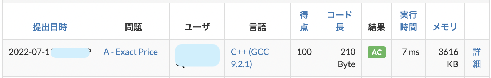

# 競技プログラミング

## 競技プログラミングって何??

競技プログラミングは、与えられたの問題の答えを満たすプログラムを書く速さと正確性を競う競技です。例えば、以下のような問題があります。

> 高橋君の財布の中には 100 円硬貨が 1 枚以上入っており、それ以外には何も入っていません。  
> 高橋君の財布の中の合計金額が X 円である可能性はありますか？  
> ([AtCoder Beginner Contest223 A 問題より](https://atcoder.jp/contests/abc223/tasks/abc223_a))

この問題の解法を考えてみましょう。
まず

- 高橋くんの財布の中には 100 円硬貨のみ入っているので、高橋くんの財布の中には 100 の倍数円入っていることがわかります。
- つまり、もし X が 100 の倍数なら可能性があり、そうでないなら可能性はないことがわかります。
- ただし、0 も 100 の倍数ですが、100 円硬貨は 1 枚以上あるので、X ＝ 0 の場合は可能性がありません。

以上のことをもとに、正しく回答するためのプログラムを作成し、提出をします。

```c++
#include "bits/stdc++.h"

using namespace std;

int main(){
    int x;
    cin >> x;

    if(x % 100 == 0 && x != 0){
        cout << "Yes" << endl;
    }else{
        cout << "No" << endl;
    }
}
```



他にもさまざまな解き方があると思いますが、なるべく早く正確に解いて提出することで順位が上がります。

いくつか問題の例を置いておきます。

- [when?](https://atcoder.jp/contests/abc258/tasks/abc258_a)  
  21 時ちょうどから x 分後の時刻を　 HH:MM の形式で答える問題（例:67 分後 →22:07）
- [Rolling Dice](https://atcoder.jp/contests/abc208/tasks/abc208_a)  
  6 面サイコロを a 回ふり、出た目の合計が b になることはあるか答える問題
- [移動(Moving)](https://atcoder.jp/contests/joi2022yo1a/tasks/joi2022_yo1a_b)
  ある 3 点間の移動を規定時間以内に行えるか答える問題

## KSS PC Club での競技プログラミングへの取り組み

KSS PC Club の部員で競プロをやっている者の多くは、毎週末に開催される AtCoder 社主催のコンテストに参加しています。終了後、OB（大学生や 6 年生）も交えて、チャットアプリ上で感想を出し合ったり、問題の解説をしあったりしています。

また、毎年、 JOI（日本情報オリンピック）に参加しており、昨年は、本戦 B ランクという素晴らしい成績を収めた部員もいます。今年度も、本戦出場を目指して、日々精進しています。
