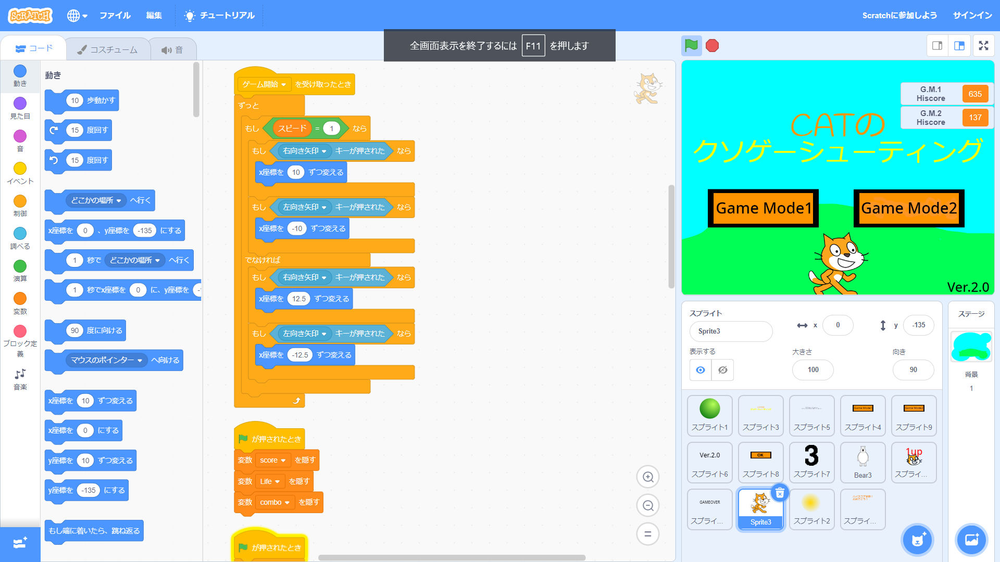

# ゲーム制作

# ゲーム制作ってどうやるの？

基本的には、あるプログラミング言語と、＋ α でゲームエンジンやフレームワークと呼ばれるソフトウェアを用いて開発を行います。  
最もメジャーなのは C#(プログラミング言語) と Unity(ゲームエンジン) の組み合わせで、実際のゲーム企業でも多く採用されています。  
そのほかにも、C++(言語) と Siv3D(フレームワーク) 、Rust(言語) と Amethyst(ゲームエンジン) など様々な言語で開発ができるほか、[Scratch](https://scratch.mit.edu/) のように、Web サイト上でゲーム開発ができるサービスも存在しています。Scratch はパズル感覚でプログラムを組むことができるため、初学者がプログラミングの基本を学ぶのにおすすめです。

## Scratch でのゲーム開発例

これが Scratch の制作画面です。画面左のタブから命令を選び、中央で命令を組み合わせてプログラムを作ります。全ての命令が直観的にわかる名前になっているので、コードを書くプログラミングよりも格段にとっつきやすいと思います。~~どっかの競プロとは違うな！~~  
いわゆる if 文や for 文などのプログラミングにおける基本的な構文はもちろん、ある程度高度なプログラムも実装することができます。やろうと思えばマイクラも作れるらしい...？  
Scratch で培ったプログラムの書き方や文法は、当然ほかの言語での開発に大いに役立ってくれます。

(部員による作品「CAT のクソゲーシューティング」をお借りしました。)

## KSS PC CLUB でのゲーム開発

多くの部員がゲーム開発に興味をもっており、特に Scratch での開発が盛んにおこなわれています。文化祭での作品展では、作ったゲームを展示する部員も多いです。  
もちろん、Scratch 以外の言語を用いてゲーム開発にチャレンジしている部員も多くおり、音ゲーや弾幕ゲーの開発や、先述のゲーム開発用フレームワークアプリケーションである [Siv3D](https://siv3d.github.io/ja-jp/) の開発に関わる部員もいます。

## 終わりに

いかがだったでしょうか。PC 部では、ゲーム開発が盛んなこともあり、それに関する会話も多く飛び交い、時には教えあいながら成長しています。自分が興味を持った言語で、開発にチャレンジしてみましょう！
