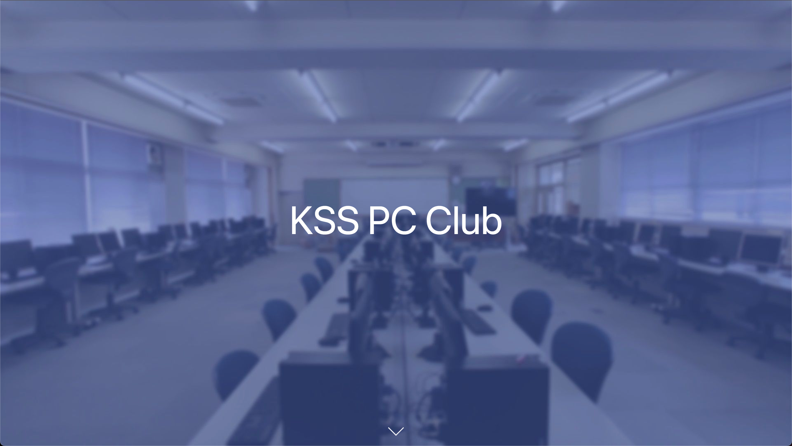
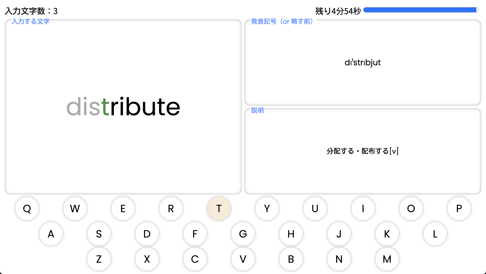
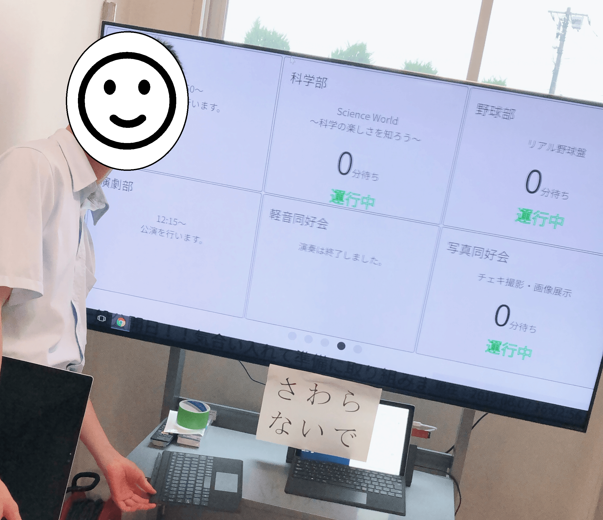
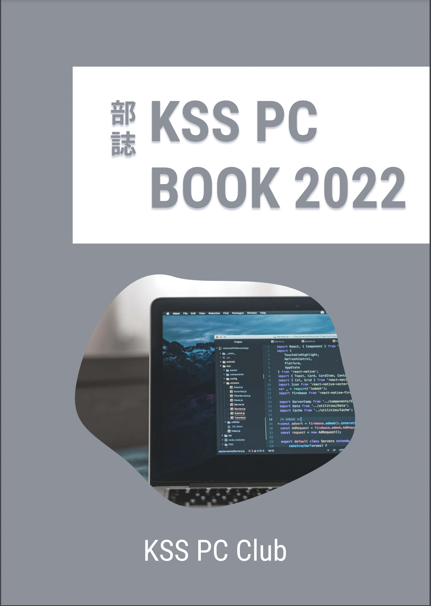

# リンク

私たち、KSS PC Club の運営するアカウントやサイトへのリンク一覧です。
ぜひご覧ください！

## 公式 web サイト

2020 年度より<ruby>開設<rt>かいせつ</rt></ruby>した公式 web サイトでは、活動内容や受賞歴、記事の発信などを行なっています。<ruby>GitHub<rt>ギットハブ</rt></ruby> というサイトでコードを公開しており、各部員によってデザインやコーティングが行われています。

- [トップページ](https://kss-pc.club)
- [投稿記事一覧](https://kss-pc.club/articles)
- [Github リポジトリ](https://github.com/kss-pc-club/website)

## SNS アカウント

### [Github](https://github.com/kss-pc-club)

公式 web サイトの項でも紹介した通り、部活内で作成したコードを共有、またインターネット上に公開するために運営しています。
一部の制作物のコードの閲覧および完成品の閲覧ができるのようになっているので、興味のある方はぜひご覧ください。

### [Youtube](https://s.kss-pc.club/youtube)

現状コンテンツがありませんが、今後さまざまな動画を投稿していく予定です！

## 主な制作物

### 1. KSS Typing

プログラミングやコンピュータに関連する英単語を集めた 5 分間のタイピングゲームです。日々単語の追加などを行なっています。キーのタッチ位置を視覚的に表示するなど、初心者でもわかりやすいと好評です。
KSS PC Club では 1 年生がこのゲームでタイピングの練習を行なっています。

- プレイは[こちら](https://typing.kss-pc.club/)
- GitHub リポジトリは[こちら](https://github.com/kss-pc-club/typing)

### 2. 文化祭待ち時間モニター

2019 年度/2022 年度の文化祭で、各模擬店の待ち時間を表示するために制作されたモニターです。各模擬店が待ち時間を入力すると、即座にモニター側に反映されるようになっており、模擬店側のアプリにはチャット機能や売り上げ管理機能が搭載されています。

### 3. 部誌

2022 年度から、KSS PC Club でも、部活動で学習したことや自分の好きなことを記事にする部誌の制作を開始しました。6 月に開催された文化祭に合わせて制作し、今年度は現役、OB 含め 7 名が執筆を担当しました。内容は多岐に渡り、数学やプログラミング言語、キーボード自作などさまざまです。ぜひご一読ください!

閲覧は[こちら](https://repos.kss-pc.club/book-2022/book-v.pdf)から!

| タイトル                               | Writer              | PDF                                                           |
| -------------------------------------- | ------------------- | ------------------------------------------------------------- |
| はじめに                               | Ryoga.exe           | [PDF](https://repos.kss-pc.club/book-2022/book-v.pdf#page=5)  |
| この部誌を支える技術                   | Ryoga.exe           | [PDF](https://repos.kss-pc.club/book-2022/book-v.pdf#page=6)  |
| ICPC へのお誘い                        | Asa                 | [PDF](https://repos.kss-pc.club/book-2022/book-v.pdf#page=11) |
| ワンクリック詐欺サイト解剖してみた     | hnm876_md           | [PDF](https://repos.kss-pc.club/book-2022/book-v.pdf#page=19) |
| ニュートン法で近似をしよう             | Anthony             | [PDF](https://repos.kss-pc.club/book-2022/book-v.pdf#page=25) |
| 基本/応用技術者試験合格体験記          | Anthony & Ryoga.exe | [PDF](https://repos.kss-pc.club/book-2022/book-v.pdf#page=37) |
| キーボードが欲しかったので自作してみた | Nagaso.cpp          | [PDF](https://repos.kss-pc.club/book-2022/book-v.pdf#page=42) |
| プログラミング言語 Zig の基本文法      | eno1220             | [PDF](https://repos.kss-pc.club/book-2022/book-v.pdf#page=55) |
| 始めよう、ArchLinux                    | 香風智乃            | [PDF](https://repos.kss-pc.club/book-2022/book-v.pdf#page=66) |
